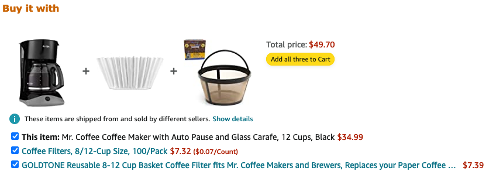

# Containers: lists, tuples, sets and dictionaries
Python offers several built-in container types complemented by
syntactic sugar that allows us to model complex problem space
with minimal code. 

This week we explored the fundamental container types: lists,
tuples, sets and dictionaries; and how they may be used in various
applications such as:
- simple voter fraud detection
- predictive analytics
- ...

Before we dive into this week's assignment, here is a quick overview
of the containers and some notes highlighting areas that can trip 
you up if you are not paying attention.

## Lists
Python lists are `ordered` `mutable` sequences. Lists are created
by enclosing a comma separated sequence of objects using `[]` syntax
or using `list()` constructor method that accepts a sequence iterator
as its argument. The items in the list are accessed by an `index`; list 
indexing is zero-based. 

> remember in Python **everything** is an object!

```python
my_list = ['apple', 5, 10.99]
list_from_a_list = list(my_list)
print(my_list)
print(list_from_a_list) # same content but a different `list`!
```

Python lists:
1. are `ordered` and `mutable`
    ```python
    basket = [[('orange', 5), 10.99]]
    print('before: ', basket)

    # change (mutate) the price of an orange
    member_discount = 0.10
    basket[0][1] = round(basket[0][1] * (1 - member_discount), 2)
    print('after : ', basket)
    ```

    The output should look as below:
    ```sh
    before:  [[('orange', 5), 10.99]]
    after :  [[('orange', 5), 9.89]]
    ```

2. can contain any type including nested lists:
    ```python
    # a list containing a **nested** list that in turn contains
    # an integer, a dict, and a tuple
    transactions = [[1,{'name': 'orange', 'count': 5},(10.99,9.99)]]
    ```
3. are dynamic (i.e can grow and shrink):
    ```python
    # in the example below, we change the price of first itemset in 
    # `basket` demonstrating mutability and add a second itemset to
    # illustrate lists can grow (and shrink).
    basket = [[('orange', 5), 10.99]]
    print('before: ', basket)

    new_item_set = [('pear', 10), 5.99]
    basket.append(new_item_set)
    print('after : ', basket)

    del basket[0]
    print('after del:', basket)
    ```

    The output should look as below:
    ```sh
    before:  [[('orange', 5), 10.99]]
    after :  [[('orange', 5), 10.99], [('pear', 10), 5.99]]
    after del: [[('pear', 10), 5.99]]
    ```
4. have language support (syntax) for common operations:
  In addition to various list methods, Python allows common
  operations to be expressed using syntactic sugar.
    ```python
    # concat operations
    apples = ['🍎', '🍏']
    berries = ['🍓', '🫐']
    fruits = apples + berries # the `+` operator does concat
    exotics = ['🥝', '🥭', '🍍', '🥥']
    fruits += exotics # concat and assign
    print('fruits: ', fruits)

    # splice operations: [start:end:step]
    print('odd fruits: ', fruits[::2])
    print('berries: ', fruits[2:4])  
    print('exotics: ', fruits[-4:])
    print('reversed: ', fruits[::-1])

    # mutate: replace apples with grapes and watermelon
    fruits[0:2] = ['🍇', '🍉']
    print('bad apples gone?: ', fruits)
    ```

    ```sh
    fruits:  ['🍎', '🍏', '🍓', '🫐', '🥝', '🥭', '🍍', '🥥']
    odd fruits:  ['🍎', '🍓', '🥝', '🍍']
    berries:  ['🍓', '🫐']
    exotics:  ['🥝', '🥭', '🍍', '🥥']
    reversed:  ['🥥', '🍍', '🥭', '🥝', '🫐', '🍓', '🍏', '🍎']
    bad apples gone?:  ['🍇', '🍉', '🍓', '🫐', '🥝', '🥭', '🍍', '🥥']
    ```

## Tuples
Python tuples are `ordered` and `immutable` sequences. Tuples are 
created by enclosing a comma separated sequence of objects using
`()` syntax or using `tuple()` constructor method that accepts a 
sequence iterator as its argument. The items in the list are accessed
by an `index`; tuple indexing is zero-based.

Tuples are similar to a `list`; syntactical sugar used with lists can
be used with tuples as well with a few exceptions. One noteworthy 
exception is the creation of a `tuple` with a single item; because `()`
is used for grouping precedence in mathematical expressions, a tuple
with a single item will need to end with a comma - e.g `(hi,)`.

Python tuples:
1. are ordered but *not* mutable
    ```sh
    >>> foo = (1, 2, 3)
    >>> foo[0] = 3
    Traceback (most recent call last):
      File "<stdin>", line 1, in <module>
    TypeError: 'tuple' object does not support item assignment
    ```
2. can be used as keys in a `dict` unlike `list`
3. take up less space (memory) than a list

## Dictionaries and Sets
Dictionaries (`dict`) and sets (`set`) are called `key` containers
with no `a priori` order. They provide fast access to values using 
`keys` that are unique. The `key` is the index and the order of values
stored within a key container cannot be known `a priori`.

The uniqueness of the `key` is determined by its `hashability`.

> [Python Glossary](https://docs.python.org/3/glossary.html#term-hashable)
>
> An object is hashable if it has a hash value which never changes
> during its lifetime (it needs a __hash__() method), and can be
> compared to other objects (it needs an __eq__() method). Hashable
> objects which compare equal must have the same hash value.
>
> Hashability makes an object usable as a dictionary key and a set
> member, because these data structures use the hash value internally.
>
> List of immutable types:
> >int, float, decimal, complex, bool, string, tuple, 
> >range, frozenset, bytes
>
> List of mutable types:
> >list, dict, set, bytearray, user-defined classes

### Dictionary
The `dict` contains a set of `key: value` pairs, and can be initialized
by enclosing any number of such pairs within `{}` or the `dict()` 
constructor method.

```python
# python dicts are the native and go to data structure to model
# any problem. The key needs to be unique and hashable, while the
# value can be anything
fruits = {
  'apples': {'🍎', '🍏'}, 
  'berries': {'🍓', '🫐'},
  'exotics': {'🥝', '🥭', '🍍', '🥥'},
  'outlier': "I am not fruit",
  'exception': 5,
  'wtf': 9.9,
}

for category, items in fruits.items():
  print(category, type(items), items)
```

Verify output; it should look as below:
```sh
# NOTE: depending on your terminal capabilities and OS, the unicode
# symbols may display as their unicode value (e.g: '\U0001fad0'). This
# is okay and not an error in our code.
apples <class 'list'> ['🍎', '🍏']
berries <class 'tuple'> ('🍓', '🫐')
exotics <class 'set'> {'🍍', '🥝', '🥭', '🥥'}
outlier <class 'str'> I am not fruit
exception <class 'int'> 5
wtf <class 'float'> 9.9
```

### Set
The `set` contains a set of `unique` values, and can be initialized by
enclosing any number of such values (that are `hashable`) within `{}`
or the `set()` constructor. **Note**: since `{}` is also used for `dict` 
literals, an empty set can only be defined using the constructor method.

Python sets abstract almost all of the properties in mathematical set
theory, allowing us to write concise code. The one exception is
the complement of a set in set theory for which there is no equivalent
in Python, understandably, since a complement of a set is everything 
*not* in the set but is part of a `universal set`. Python doesn't know
what that is for your problem domain. 

It is trivial to define a `complement` if you know what the 
`universal set` of your problem domain is. For example if the universe
is the set of `fruits`, then the complement of `apples` is simply the
difference method of universal set (i.e `fruits`).

```python
# Universe
fruits = {'🍎', '🍏', '🍓', '🫐', '🥝', '🥭', '🍍', '🥥'}

# the complement is simply the difference; below we are *aliasing*
# the difference method of the universal set (i.e fruits)
complement = fruits.difference

apples = {'🍎', '🍏'}

# verify output to be {'🫐', '🥭', '🥥', '🥝', '🍓', '🍍'} 
print('not apples: ', complement(apples))
```

# Assignment for week 3
This week assignment will make us deep dive into one of the earliest
applications of data mining (a branch or a subset of data science) - 
[**cross selling**][1].

It also goes by many other names such as `recommender`, 
`market basket analysis`, `predictive analytics` and more formally
known as `association rule mining`.

An image is of course worth a thousand words:
  

At the core of all these systems is a little algorithm called [`Apriori`][2],
that makes the process of creating rulesets for thousands of itemsets
feasible. A naive implementation would take inordinate amount of time to
compute once the itemset count crosses into the 100s.

Python makes writing systems as the one above, seen on sites like
Amazon almost too easy, thanks to a wealth of libraries. The 
challenge is not in coding the algorithms but in scaling the solution,
which thankfully is not in the scope of this class.

To make it engaging, there are two levels to unlock for this assignment.
The first level is to complete it by using a [library][3]. The second
level is to implement the critical function ourselves by bringing to 
bear all that we learned about `lists`, `tuples`, `sets` and `dicts`!

As usual the [`code`][4] folder contains `main.py` which is the driver
program that sets up the details and our `predictive analytics` module
[`papack.py`][5], that has the steps outlined in comments that you will
need to complete.

Good luck!

# References
[1]: <https://qymatix.de/en/cross-selling-example-excel-analytics/> (Cross Selling)
[2]: <https://en.wikipedia.org/wiki/Apriori_algorithm> (Apriori algorithm)
[3]: <https://pypi.org/project/efficient-apriori/>
[4]: <week-03/code> (code for this week)
[5]: <week-03/code/papack.py> (assignment file)

- [Apriori algorithm for frequent item set mining][2]
- [Python lists, tuples, sets and dicts](https://docs.python.org/3/tutorial/datastructures.html)
- [Efficient Apriori Library][3]
